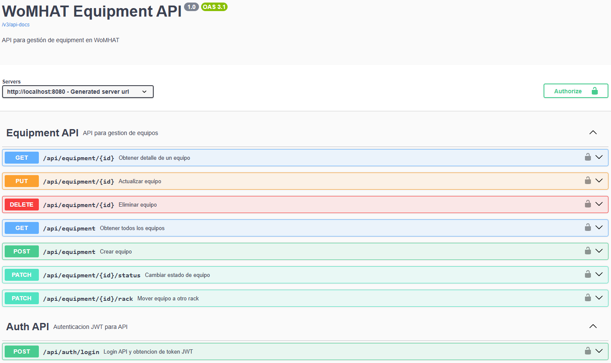
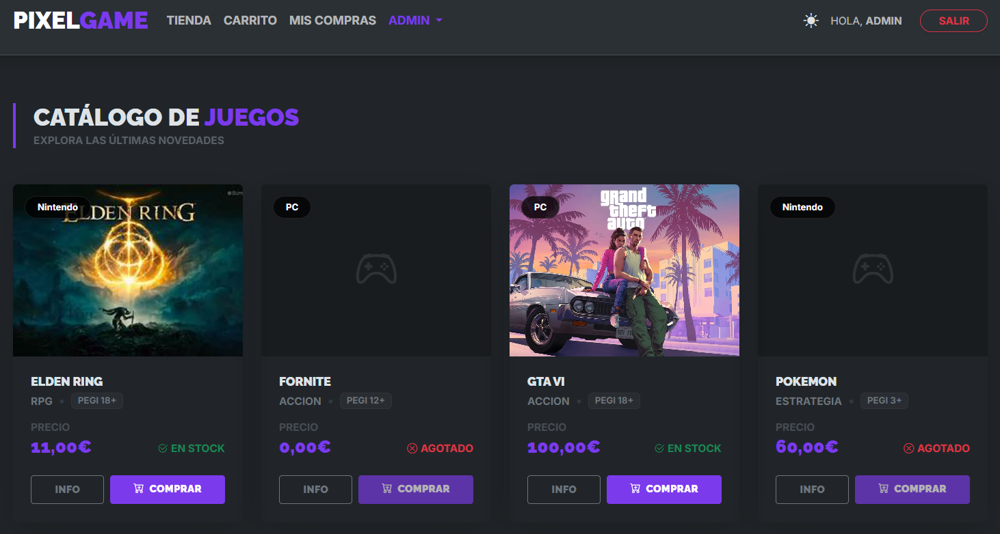

# ¡Hola 👋! Soy David González Córdoba 👨🏻‍💻

**Desarrollador Web Junior | Titulado en FP Superior de Desarrollo de Aplicaciones Web**

Me gusta construir aplicaciones web útiles, bien estructuradas y fáciles de mantener.  
Estoy centrado en seguir creciendo como desarrollador y aplicar buenas prácticas reales de desarrollo, documentación y despliegue.

---

## 🧭 Sobre mí

- 🎓 Titulado en **Desarrollo de Aplicaciones Web**.
- ☕ Interés en backend con **Java, Spring Boot y APIs REST**.
- 🎨 También trabajo la parte frontend con **HTML, CSS, JavaScript y Bootstrap**.
- 🧱 Me gusta estructurar el código en capas y documentar lo realizado.
- 🔐 Me interesa aplicar seguridad y validación de datos.
- 🤝 Me considero una persona constante, adaptable, con actitud positiva y ganas de aprender.
- 💡 Prefiero soluciones **claras y mantenibles** antes que código rebuscado.
- 🔎 Intento entender primero el objetivo real antes de ponerme a programar.
- 🛠️ Uso herramientas modernas como apoyo para aprender y mejorar, pero siempre buscando entender lo que hago.

---

## 🛠️ Tecnologías y herramientas

| Área | Tecnologías |
| :---: | :---: |
| **Backend** |         |
| **Frontend** |       |
| **Bases de datos** |    |
| **Herramientas** |       |
| **Despliegue** |  |

---

## 🚀 Proyectos

### 🏢 WoMHAT

Aplicación web tipo **DCIM** para la gestión de CPDs, salas, racks, equipos, usuarios, permisos y mantenimiento.

Proyecto desarrollado con arquitectura por capas. La versión publicada incluye además una **API REST para la gestión de equipos**.

**Stack:**  

🔗 Enlace al repositorio: [WoMHAT](https://github.com/davidgoncor3005/womhat-equipment-api)

---

### 🎮 PixelGameNow

Proyecto web desarrollado con **Symfony**, orientado a la gestión de videojuegos.

**Stack:**  

🔗 Enlace al repositorio: [PixelGameNow](https://github.com/davidgoncor3005/PixelGameNow)

---

### 🌐 Portfolio

Web personal publicada con **GitHub Pages** para mostrar mi perfil, tecnologías, proyectos y contacto.

> Portfolio en proceso de actualización.  
> La captura se añadirá más adelante, pero la web ya está publicada y se puede visitar.

**Stack:**  

🔗 Web publicada: [davidgoncor3005.github.io](https://davidgoncor3005.github.io/)  
🔗 Enlace al repositorio: [davidgoncor3005.github.io](https://github.com/davidgoncor3005/davidgoncor3005.github.io)

---

## 📫 Contacto

---

> _Última actualización: 2026-06-02_
